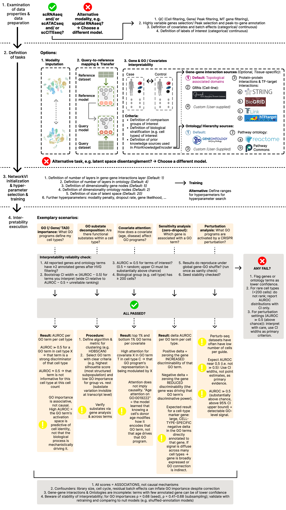

Interpretability reliability guide
===================================

This page provides a decision framework for assessing the reliability of GO
importance, TAD importance, and covariate attention scores produced by
NetworkVI. It is intended as actionable guidance for end users applying
NetworkVI to a new dataset.

.. note::

   All scores produced by NetworkVI are **associations, not causal
   mechanisms**. GO/TAD importance reflects how well a biological programme
   discriminates a cell population in the learned latent space; it does not
   imply that the programme mechanistically drives the phenotype.

----

Decision flowchart
-------------------

The figure below is the primary reference. It walks through the full workflow (from data examination and task definition to NetworkVI training and interpretability execution) and summarises when results are reliable, when they are expected to fail, and what to do in each case.

----

See also
---------

* :doc:`notebooks/go_analysis` — step-by-step tutorial for GO and gene importances
* :doc:`notebooks/go_specific_covariate_attention` — tutorial for GO-specific covariate attention
